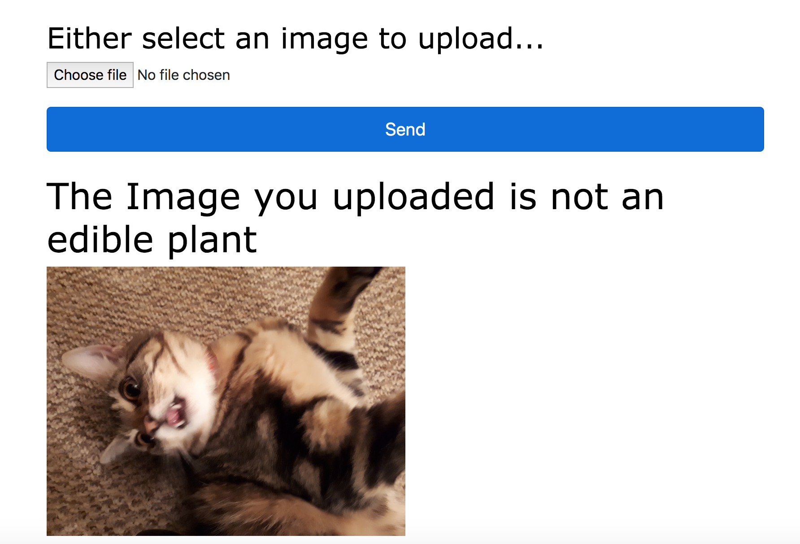
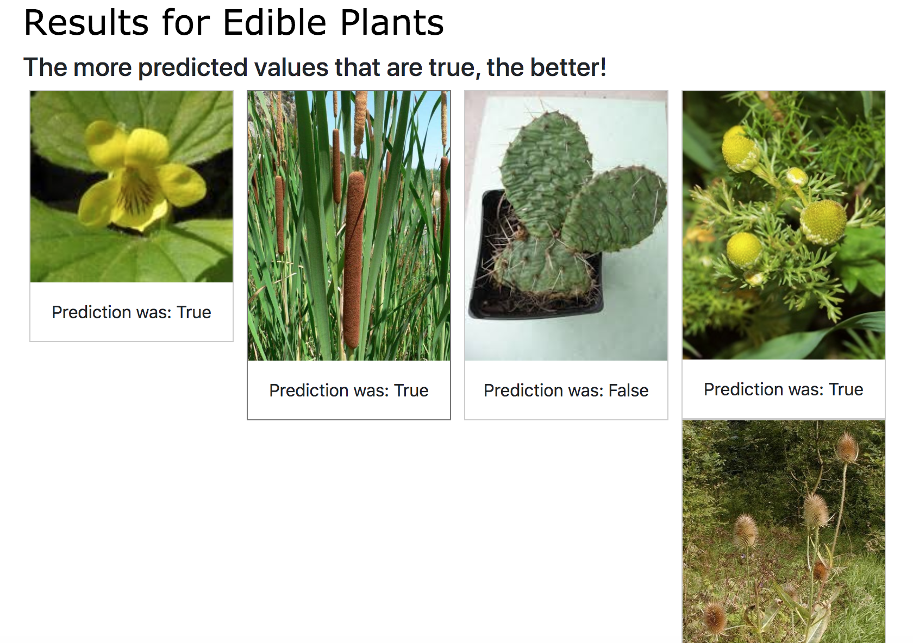
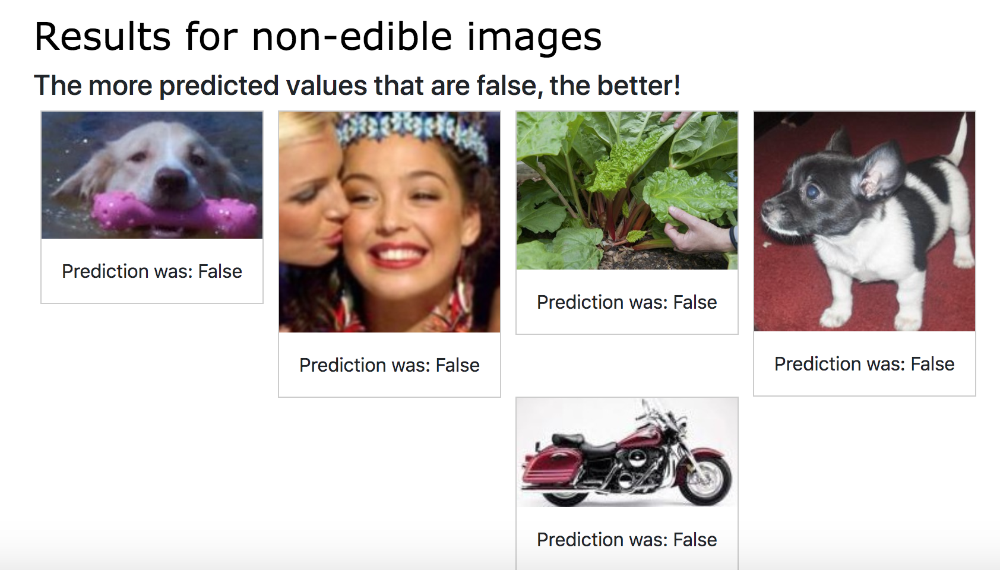

# Machine Learning Edible Plants

A machine learning model that determines if a plant is edible or not. There are currently
two ways this is achieved.

## Upload an image

1. Select the choose button, upload an image, and it will say if it is an edible plant or not.

## Select five edible plants and five non-edible images at random to make predictions

1. Select the button `show sample predictions`

# Plan of action followed to achieve this

## Getting the data together

1. Refer to 'List of edible stuff' - collect images
2. Refer to 'List of non edible stuff' collect images

## Creating the model

3. Create the dataframe with the following columns (route for creating model)
    - url (name of the image)
    - name (can be a plant, car, plane...etc)
    - edible (car = 0, edible plant = 1)
4. Create the model (refer to section)
5. Use hyper parameters; save mutliple weight files and compare and use best
6. Train the model against edible and non-edible images.

## Making predictions

7. Based on our prediction, if the plant is classified as edible, then show
that its an edible plant, along with the name. (route for predicting)
8. Based on the prediction, return whether it is edible or not.

## Extras

9. Add new images to DataSet if needed

## List of edible stuff

- Edible plants

## List of non-edible stuff

- Tree's.
- Cars
- planes
- Animals
- Fruits
- Poisonous
- Plants

# How to run

1.  Install requirements via `requirements.txt`
2. Bring in some test data under the `static` folder. The name of the folder should
be called `Model_data` and the hierarchy should be:
    - Model_Data
        - test_dataset
            - edible
                - images
            - non-edible
                - images
        - train_dataset
            - edible
                - images
            - non-edible
3. Go to the application directory and run `python3 ./app.py`
4. Go to `localhost:5000/create-model` to create a model against the training data above.
The weights will then be saved (by default this will save as `edible_weights_v1.h5`.
5. However, you don't need to train the model to use this, the weights file can be used to
predict images straight off.